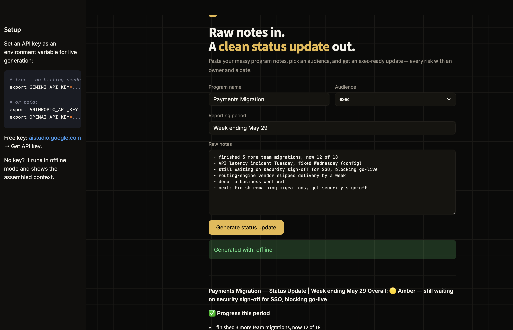

# 📊 Program Status Agent

A tiny, **model-agnostic** Streamlit app that turns raw program notes into a clean, audience-tuned status update — the TPM OS [`status-update`](../../skills/status-update) skill wrapped in a friendly web UI.



Paste your messy notes, pick an audience (exec / stakeholder / engineering), and get a RAG-rated status update with every risk carrying an owner and a date.

## Run it

```bash
pip install -r requirements.txt
streamlit run app.py
```

It opens in your browser. Works **offline** out of the box (shows the assembled context). For fully LLM-written updates, set a key first.

**Free — Gemini (no billing):** get a key at [aistudio.google.com](https://aistudio.google.com):
```bash
pip install google-generativeai
export GEMINI_API_KEY=...
streamlit run app.py
```

**Or paid — Claude / OpenAI:**
```bash
pip install anthropic        # or: pip install openai
export ANTHROPIC_API_KEY=... # or: export OPENAI_API_KEY=...
streamlit run app.py
```

The app resolves **Gemini → Claude → OpenAI → offline**, so whatever you have set is used automatically.

## How it works

- **Streamlit UI** — notes in, status update out, one-click download.
- **Model-agnostic** — resolves Claude → OpenAI → offline, so the same app runs with any provider or none.
- **Skill-driven** — it loads the same [`SKILL.md`](../../skills/status-update/SKILL.md) a human would use, so the agent's behavior and a human's are one source of truth.

## Why it exists

Most status updates get written from scratch every week, under time pressure, with quality drifting exactly when stakes are highest. This agent makes the *structure* free so the judgment stays yours.

---

Part of [TPM OS](https://github.com/gayatriswaminathan/tpm-os) · built by [Gayatri Swaminathan](https://github.com/gayatriswaminathan)
